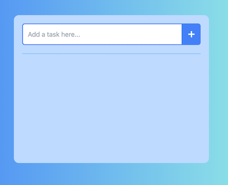
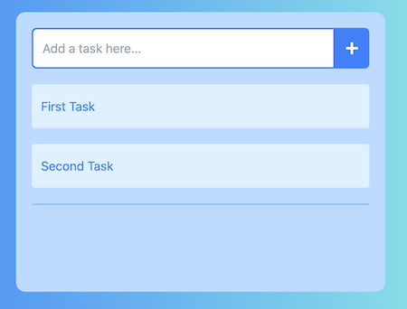
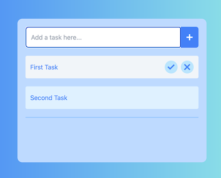
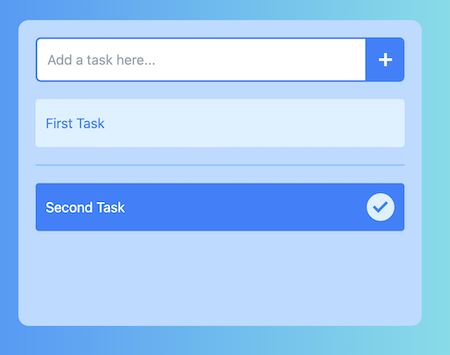
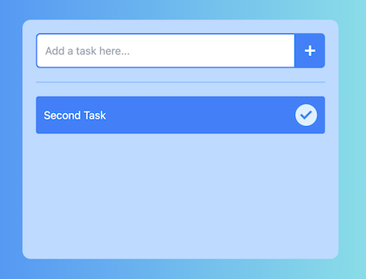

**Supercharge Your Productivity with a Blazing-Fast Todo App**

This sleek and efficient Todo app leverages the power of Vite, React, and Tailwind CSS to deliver a smooth user experience. Built for exploration and customization, it's your perfect companion for conquering your daily tasks.

⚡️ Explore the Future of Web Development

Vite for Lightning-Fast Development: Experience the joy of rapid prototyping and seamless hot reloading.
React for Dynamic UI: Craft an interactive and reactive user interface that seamlessly adapts to your needs.
Tailwind CSS for Effortless Styling: Apply beautiful and responsive design in a breeze with utility-first classes.
** Get Up and Running in Minutes**

Clone the Repository: Quickly grab the code with git clone [https://github.com/AbdulHakeem/todo-app.git.](https://github.com/AbdulHakeem518/TODO-List-with-ReactJS)
Install Dependencies: Power up the project with npm install.
Launch Your Todo Haven: Start the development server with npm run dev and access it at http://localhost:5173.
**Take a Peek at the Action**

**Initial Screen:** See the clean and inviting starting point for your productivity journey  . 
**Effortless Todo Creation:** Breeze through adding new tasks with a user-friendly interface  .  
**Interactive Todo List:** Get a visual overview with hover effects for easy management   
.
Strikethrough Completed Tasks: Mark off completed items for a satisfying sense of accomplishment  . 
**Clean Deletion:** Remove unwanted tasks with a simple swipe  . 
**Dive In and Customize**

This repository serves as a solid foundation for you to build upon. Feel free to explore the code, personalize the styling, and add new features to create the ultimate Todo app that perfectly suits your workflow.

Let's get organized - together!
